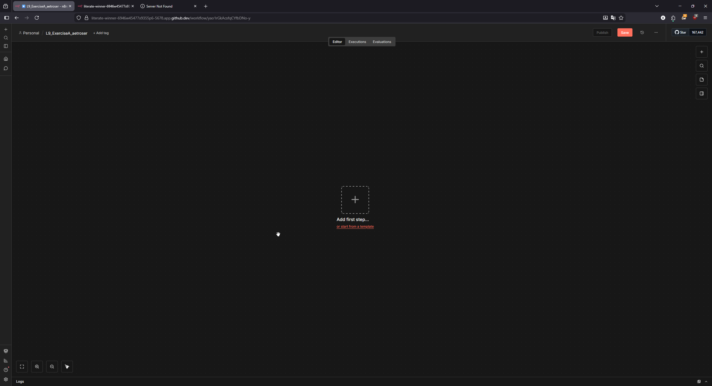
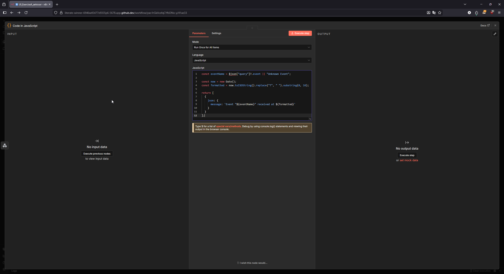
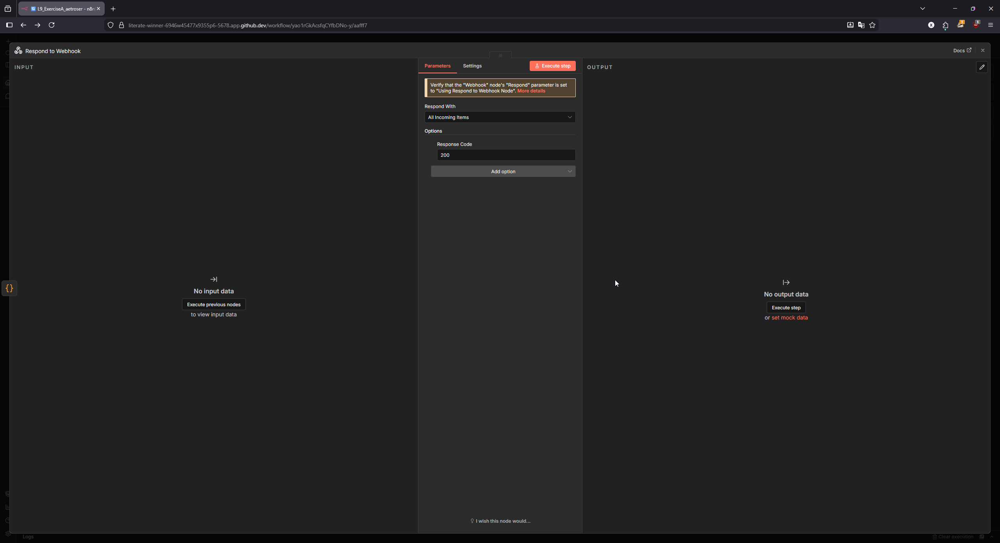
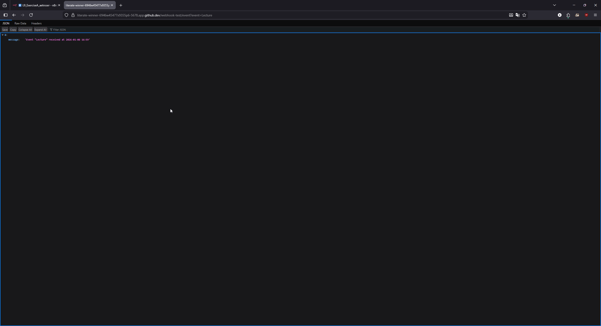
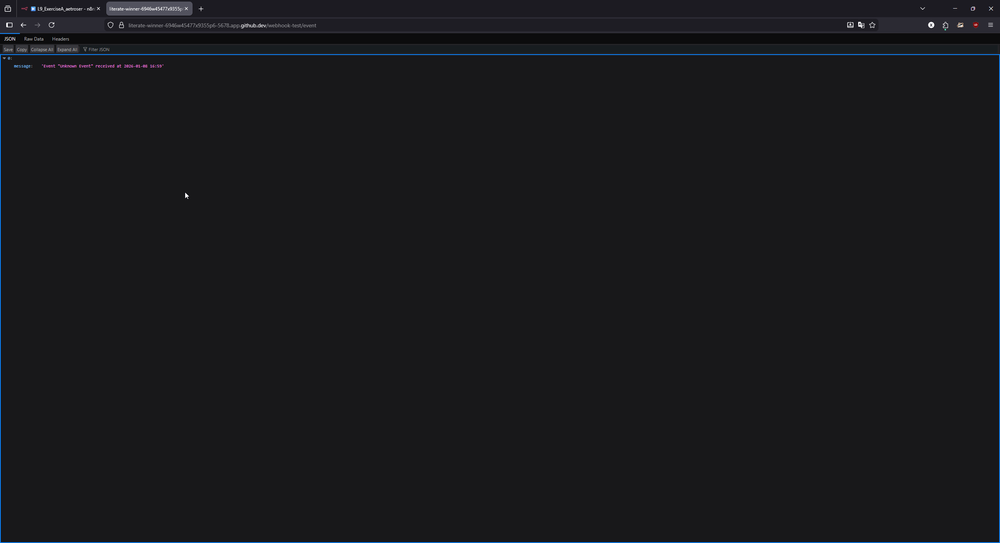

# L9, Exercise A – Webhook → Date and Time Formatting - Solution

**Student Name:** [Your Name]  
**GitHub Username:** [Your GitHub Username]  
**Date:** [Submission Date]

---

## Step 1: Workflow Creation

**Screenshot: Newly created workflow with proper naming**



*Screenshot showing the workflow named `L9_ExerciseA_<your_github_username>`*

---

## Step 2: Webhook Node Configuration

**Configuration:**
- HTTP Method: `GET`
- Path: `event`
- Response Mode: `Using 'Respond to Webhook' node`

---

## Step 3: Code Node Configuration

**Screenshot: Code node configuration**



*Screenshot showing the Code node configuration with the address bar visible*

**Code used:**
```javascript
const eventName = $json["query"]?.event || "Unknown Event";

const now = new Date();
const formatted = now.toISOString().replace("T", " ").substring(0, 16);

return [
  {
    json: {
      message: `Event "${eventName}" received at ${formatted}`
    }
  }
];
```

---

## Step 4: Respond to Webhook Node Configuration

**Screenshot: Respond to Webhook node configuration**



*Screenshot showing the Respond to Webhook node configuration with the address bar visible*

**Configuration:**
- Response Code: `200`
- Respond With: `All incoming items`

---

## Step 5: Test Results

**Screenshot: Workflow execution result - Lecture parameter**



*Screenshot showing the result with event=Lecture parameter*

**Screenshot: Workflow execution result - Meeting parameter**


*Screenshot showing the result with event=Meeting parameter*

**Screenshot: Workflow execution result - No parameter**



*Screenshot showing the result without parameter (Unknown Event)*

**Test URLs used:**
```
http://[YOUR_CODESPACE_URL]/webhook-test/event?event=Lecture
http://[YOUR_CODESPACE_URL]/webhook-test/event?event=Meeting
http://[YOUR_CODESPACE_URL]/webhook-test/event
```

**Example output received:**
```json
{
  "message": "Event \"Lecture\" received at 2026-01-08 10:30"
}
```

---

## Step 6: Workflow Activation

**Status:** ✅ Workflow activated

**Production URL:**
```
http://[YOUR_CODESPACE_URL]/webhook/event?event=Workshop
```

---

## Notes and Observations

[Add any additional notes, challenges faced, or observations here]

---

## Completion Checklist

- [x] Workflow properly named
- [x] Webhook node configured correctly
- [x] Code node implemented and tested
- [x] Respond to Webhook node configured
- [x] All screenshots provided with visible address bars
- [x] Test execution successful
- [x] Workflow activated (optional)
